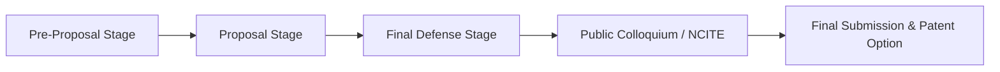

# 1. Program and Governance Guidelines (DCT CCS BSIT)

## 1.1 Institutional Identity & Core Values

### Vision
> A God-loving educational community with passion for truth and compassion for humanity.

### Mission
We commit ourselves to the:
1. Total formation of the person
2. Promotion of truth
3. Transformation of values for the service of humanity

### Goals & Objectives
Transformative education responsive to Wisdom, Social Responsibility, and Christian Witness:
* **Wisdom**:
  * *Cognitive*: Knowledge and skills for social communication.
  * *Affective*: Sensitive awareness of role in social building.
  * *Psychomotor*: Engagement in relevant social issues.
* **Social Responsibility**:
  * *Cognitive*: Awareness of Filipino Christian values.
  * *Affective*: Appreciation of Christian dignity as stewards of God's creation.
  * *Psychomotor*: Moral commitment to ecological balance.
* **Christian Witness**:
  * *Cognitive*: Understanding scriptural teachings.
  * *Affective*: Manifest love for scripture.
  * *Psychomotor*: Practice scriptural truths in daily life.

---

## 1.2 Program Graduate Outcomes (BSIT - CMO 25 s. 2015)

| Code | Attribute | Program Graduate Outcome Description |
| :--- | :--- | :--- |
| **IT01** | Knowledge for Solving Computing Problems | Apply knowledge of computing, science, and mathematics appropriate to the discipline. |
| **IT02** | Knowledge for Solving Computing Problems | Understand best practices and standards and their applications. |
| **IT03** | Problem Analysis | Analyze complex problems, and identify and define computing requirements appropriate to solutions. |
| **IT04** | Problem Analysis | Identify and analyze user needs; take them into account in selecting, creating, evaluating, and administering systems. |
| **IT05** | Design/Development of Solutions | Design, implement, and evaluate computer-based systems, processes, components, or programs under realistic constraints. |
| **IT06** | Design/Development of Solutions | Integrate IT-based solutions into the user environment effectively. |
| **IT07** | Modern Tool Usage | Apply knowledge through modern techniques, skills, tools, and practices necessary for IT. |
| **IT08** | Individual and Team Work | Function effectively as a member or leader of a development team recognizing different roles. |
| **IT09** | Individual and Team Work | Assist in creating an effective IT project plan. |
| **IT10** | Communication | Communicate effectively with computing community and society at large via logical writing and presentations. |
| **IT11** | Professionalism & Social Responsibility | Analyze local and global impact of IT on individuals, organizations, and society. |
| **IT12** | Professionalism & Social Responsibility | Understand professional, ethical, legal, security, and social responsibilities in IT. |
| **IT13** | Life-Long Learning | Engage in continuous self-learning and improving performance for ongoing professional development. |

---

## 1.3 Project Duration and Phases

BSIT Capstone Projects are completed across **one (1) to three (3) semesters** (up to 9 units maximum).

### Phase Breakdown
1. **Pre-Proposal Stage**:
   * Course Enrolment & Capstone Project Orientation.
   * Shortlisting of potential projects and client problem identification.
2. **Proposal Stage (Capstone 1)**:
   * Title Proposal & Critiquing (with patentability check if applicable).
   * Manuscript Writing: Chapters 1, 2, 3, and planning/design sections of Chapter 4.
   * Plagiarism clearance prior to defense.
   * Proposal Oral Defense & Manuscript Revisions.
3. **Final Defense Stage (Capstone 2)**:
   * Execution: Full Analysis, Design, Development, and Testing.
   * Complete Manuscript Writing (Chapters 1–5, Preliminary Pages, Appendices A–J).
   * Plagiarism checking by Research Office / Library.
   * Final Defense Proper & Manuscript Revisions.
4. **Public Presentation**:
   * Mandatory presentation in a public forum (School Colloquium, Regional/National Conference like PSITE NCITE).
5. **Final Submission & Optional Patent Stage**:
   * Hardbound submission with signed approval sheets and IP transfer acknowledgment.
   * Optional Patent Drafting, Application, and Technology Transfer.

---

## 1.4 Team Composition & Defined Roles

Teams consist of **two (2) to four (4) [up to 5] members** depending on project complexity.

| Role | Key Responsibilities | Primary Coordination |
| :--- | :--- | :--- |
| **Project Manager (PM)** | Overall project authority, schedule, budget, risk management, scope control, and deliverable tracking. | Coordinates entire team, Adviser, and Dean. |
| **Systems Analyst / Database Designer (SA/DD)** | System architecture coordination, requirements analysis, ERD, normalization, data dictionary, data integrity. | Coordinates closely with PM & UI Designer. |
| **Network Designer / UI Designer (ND/UID)** | UI/UX mockups, forms, screen flows, storyboards, network architecture, topology, and security models. | Coordinates with SA/DD and Programmer. |
| **Software Engineer / Programmer (SE/P)** | System architecture implementation, coding, module unit testing, integration, and bug fixing (up to 2 co-programmers). | Coordinates with ND/UID and QA Tester. |
| **QA Tester / Technical Writer (QA/TW)** | Test cases execution (unit/integration/load/stress/acceptance), bug tracking, manuscript formatting, user manual, and appendices. | Coordinates with Programmer and PM. |

### Policy on Regrouping
* If fewer than three (3) members remain when transitioning from Capstone 1 to Capstone 2, the group may be disbanded and absorbed into other groups (respecting team size caps).
* If remaining members choose to continue, they may proceed only with formal written consent of the Adviser and Dean; project scope must be adjusted accordingly.

---

## 1.5 Adviser and Panel Governance

### Panel Composition
* **1 Panel Chairman**: Leads proceedings, briefs proponents, issues the official unanimous verdict, nominates for awards.
* **2 Panel Members / Context Experts**: Validate adviser endorsement, evaluate deliverables/manuscript, test system functionality, recommend verdicts.

### Adviser Duties & Qualifications
* Must hold a computing degree beyond the bachelor's degree and preferably be full-time faculty.
* Maximum load: **5 projects** (strictly no more than 10).
* Panelists limited to **10 projects** (max 20 across all institutions).
* Adviser reviews all deliverables, meets monthly with team, guides research design/bibliography, and signs defense clearance notices.
