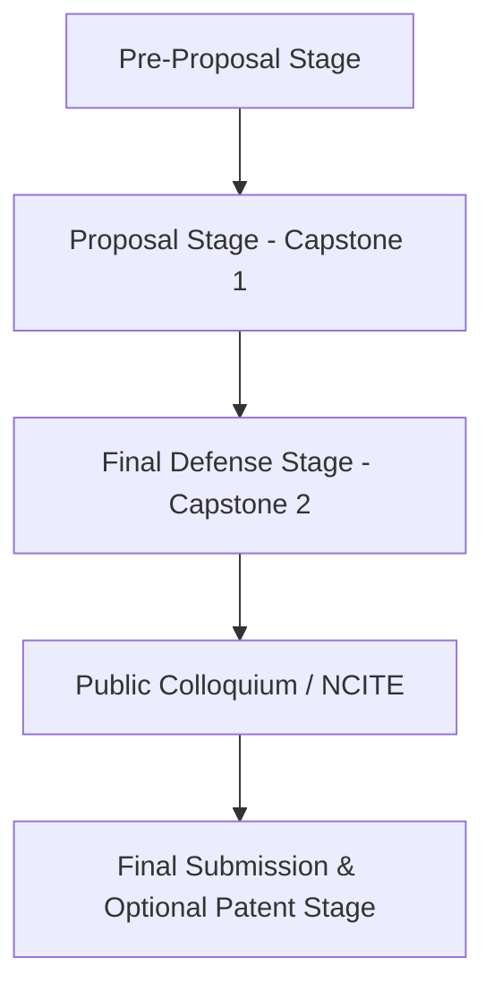

# 1. Program and Governance Guidelines (DCT CCS BSIT)

## 1.1 Institutional Identity & Core Values

### Vision
> A God-loving educational community with passion for truth and compassion for humanity.

### Mission
We commit ourselves to the:
1. Total formation of the person
2. Promotion of truth
3. Transformation of values for the service of humanity

### Goals & Objectives
Transformative education responsive to Wisdom, Social Responsibility, and Christian Witness:
* **Wisdom**:
  * *Cognitive*: Possess knowledge and skills for social communication.
  * *Affective*: Demonstrate sensitive awareness of one’s role in social building.
  * *Psychomotor*: Positively engage oneself in relevant social issues.
* **Social Responsibility**:
  * *Cognitive*: Inculcate awareness of Filipino Christian values.
  * *Affective*: Show appreciation of our Christian dignity as stewards of God’s creation.
  * *Psychomotor*: Promote moral commitment to ecological balance.
* **Christian Witness**:
  * *Cognitive*: Acquire understanding scriptural teachings.
  * *Affective*: Manifest love for the scripture.
  * *Psychomotor*: Practice scriptural truths in every aspect of life.

### Institutional Graduate Outcomes
* **Competent** • **Disciplined** • **Life-long Learner** • **Steward**

---

## 1.2 Program Graduate Outcomes (BSIT - CMO 25 s. 2015)

| Code | Attribute | Program Graduate Outcome Description |
| :--- | :--- | :--- |
| **IT01** | Knowledge for Solving Computing Problems | Apply knowledge of computing, science, and mathematics appropriate to the discipline. |
| **IT02** | Knowledge for Solving Computing Problems | Understand best practices and standards and their applications. |
| **IT03** | Problem Analysis | Analyze complex problems, and identify and define computing requirements appropriate to solutions. |
| **IT04** | Problem Analysis | Identify and analyze user needs; take them into account in selecting, creating, evaluating, and administering computer-based systems. |
| **IT05** | Design/Development of Solutions | Design, implement, and evaluate computer-based systems, processes, components, or programs to meet desired needs and requirements under various constraints. |
| **IT06** | Design/Development of Solutions | Integrate IT-based solutions into the user environment effectively. |
| **IT07** | Modern Tool Usage | Apply knowledge through the use of current techniques, skills, tools, and practices necessary for the IT profession. |
| **IT08** | Individual and Team Work | Function effectively as a member or leader of a development team recognizing the different roles within a team to accomplish a common goal. |
| **IT09** | Individual and Team Work | Assist in the creation of an effective IT project plan. |
| **IT10** | Communication | Communicate effectively with the computing community and with society at large about complex computing activities through logical writing, presentations, and clear instructions. |
| **IT11** | Professionalism & Social Responsibility | Analyze the local and global impact of computing information technology on individuals, organizations, and society. |
| **IT12** | Professionalism & Social Responsibility | Understand professional, ethical, legal, security, and social issues and responsibilities in the utilization of information technology. |
| **IT13** | Life-Long Learning | Recognize the need for and engage in planning self-learning and improving performance as a foundation for continuing professional development. |

---

## 1.3 Project Scope, Duration, and Lifecycle Stages

Based on CMO 25 s. 2015, the Capstone Project is a terminal requirement for BSIT demonstrating comprehensive knowledge of the area of study and research methods. It focuses on the infrastructure, application, or processes involved in implementing a computing solution to a significant existing problem or need.

* **Duration**: Prescribed across **one (1) to three (3) semesters** (maximum 9 units total).
* **Research Methods**: Capstone Projects do not require surveys, statistics, or descriptive methods unless appropriate.

### Stage Breakdown

#### 1. Pre-Proposal Stage
- Course Enrolment
- Capstone Project Orientation
- Shortlisting of Possible Capstone Projects & Client Identification

#### 2. Proposal Stage (Capstone 1)
- Title Proposal and Critiquing (with Patentability Check if possible)
- Writing Chapters 1, 2, 3, and planning/design sections of Chapter 4
- Mandatory Plagiarism Clearance via DCT Research Office / Library
- Proposal Manuscript Submission
- Oral Defense Proper
- Proposal Manuscript Revisions

#### 3. Final Defense Stage (Capstone 2)
- Comprehensive Analysis, Design, Development, and Testing
- Full Manuscript Preparation (Chapters 1–5, Preliminary Pages, Appendices A–J)
- Mandatory Pre-Defense Plagiarism Check
- Capstone Project Manuscript Submission
- Final Defense Proper (Software Demonstration & Individual Oral Exam)
- Final Manuscript Revisions & Final Post-Defense Plagiarism Check

#### 4. Public Presentation
- Mandatory presentation in a public forum (e.g., School Colloquium or National Conference on IT Education [NCITE] of PSITE).

#### 5. Patent Process & Archiving (Optional / Final)
- Final hardbound book submission
- Patent Drafting & Application (if applicable)
- Technology Transfer & Institutional IP Signing

---

## 1.4 Team Composition & Member Roles

Teams consist of **two (2) to four (4) [up to 5] members** depending on project complexity. Multidisciplinary teams are allowed provided separate documentation is prepared per program.

| Role | Key Responsibilities | Primary Coordination |
| :--- | :--- | :--- |
| **Project Manager (PM)** | Authority to manage capstone project; leads planning and development of deliverables; manages budget, work plan, scope, issues, risks, and overall project success. | Coordinates entire team, Adviser, and Dean. |
| **Systems Analyst / Database Designer (SA/DD)** | Ensures all parts of the system are coordinated; designs complete, robust, normalized database schema; data dictionary and ERD modeling. | Coordinates closely with PM and UI Designer. |
| **Network Designer / UI Designer (ND/UID)** | Masters network architecture and configuration; prepares user-interface designs (forms, screenshots, storyboards, color/typography). | Coordinates with SA/DD and Programmer. |
| **Software Engineer / Programmer (SE/P)** | Designs, writes, and tests computer programs, custom plugins, and system logic. May include up to two (2) programmers per group (Co-Programmer). | Coordinates with ND/UID and QA Tester. |
| **QA Tester / Technical Writer (QA/TW)** | Ensures software quality and bug elimination; verifies module functionality; prepares test cases; finalizes system documentation and manuscript deliverables. | Coordinates with Programmer and PM. |

### Duties and Responsibilities of Proponents
a. Keep informed of Capstone Project Guidelines and Policies.  
b. Keep informed of schedule of activities, required deliverables, and deadlines posted by Adviser and Dean.  
c. Submit on time all deliverables specified by Adviser and Dean.  
d. Submit on time all requirements identified by the Oral Defense Panel.  
e. Submit on time requirements identified by the Adviser throughout the project duration.  
f. Schedule regular meetings (**at least once a month**) with the Adviser to report progress and raise issues.  
g. Schedule regular meetings (**at least once a semester**) with the Dean.  

### Policy on Regrouping
* If fewer than three (3) members remain from Capstone 1 to Capstone 2, the group may be disbanded and members absorbed into other groups (without exceeding team size caps).
* If remaining members decide to continue, regrouping may be waived with written consent of the Adviser and Dean; project scope must be revised accordingly.

---

## 1.5 Governance: Adviser and Panel Framework

### Panel Composition
* **1 Panel Chairman**: Briefs proponents on defense program; issues the official unanimous panel verdict; nominates projects for the Capstone Project Award.
* **2 Panel Members / Context Experts**: Validate adviser endorsement; evaluate deliverables; recommend verdicts; consider requests of adviser/proponents; nominate projects for awards.
* Assigned content experts and recorders may be included as needed.

### Panel & Adviser Qualifications
* **Adviser**: Must have completed a computing project beyond the bachelor’s degree; preferably full-time faculty (otherwise a full-time co-adviser is required); guides students through the entire lifecycle; handles **at most 5 projects** (strictly max 10).
* **Panel Members**: Must hold a degree in Computing or allied programs or be domain experts; at least one member must hold a **Master’s degree in Computing / allied field**; for IT, at least one member should preferably have **industry experience**; handles **at most 10 projects** (strictly max 20 across all HEIs).
* **External Client**: Where an external organization is involved, the client organization should be represented as much as possible.

### Adviser Duties and Responsibilities
a. Ensures the proposed study conforms to College standards and aligns with the school's research thrust.  
b. Guides students in defining research problems/objectives, building bibliography, identifying variables/hypotheses, and determining research design/environment/instruments.  
c. Meets teams regularly (**at least once a month**) by appointment to answer questions and resolve conflicts.  
d. Points out errors in development work, analysis, or documentation, reminding researchers to perform properly.  
e. Thoroughly reviews deliverables at every stage; may require regular progress reports.  
f. Recommends proponents for Title Proposal and Oral Defense (Adviser should not sign defense notices if students are unready; adviser shares responsibility if proponents fail).  
g. Clarifies points during Title Proposal and Oral Defense.  
h. Ensures all required revisions are incorporated into documents and software.  
i. Keeps informed of capstone schedules, deliverables, and deadlines.  
j. Recommends outstanding capstone projects for award nomination.  
