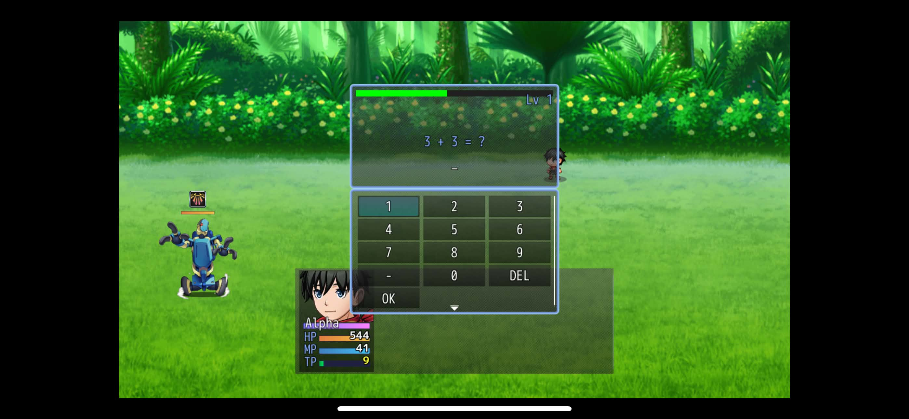

# Appendix D: Screen Design

This document gives the user interface (UI) specifications and screen layouts for *Chronicles of Arithmos: A 2D Role-Playing Game with Dynamic Math-Based Combat System and Adaptive Difficulty Scaling*. Each table gives the screen number, screen name, target user role, narrative overview, and layout image in accordance with the Dominican College of Tarlac (DCT) College of Computer Studies (CCS) Capstone Manual.

---

| Screen No.: | Screen 1 |
| :--- | :--- |
| **Screen Name:** | Title Screen Interface |
| **Target User / Role:** | Young Learner / Player / General User |
| **Narrative Overview:** | The Title Screen is the main entry window for the game. It shows the game title banner over a fantasy castle background with a holy sword in stone. The center menu gives four options: **New Game**, **Continue**, **Options**, and **Exit**. **New Game** starts a new campaign and opens the name entry screen. **Continue** opens the load screen to restore saved progress. **Options** opens the system settings menu. **Exit** closes the desktop game. Players can navigate with keyboard arrow keys and Z or X, a mouse, or a touchscreen. |
| **Screen Layout:** |  |

---

| Screen No.: | Screen 2-1 |
| :--- | :--- |
| **Screen Name:** | System Options Menu (General & Audio Settings) |
| **Target User / Role:** | Young Learner / Player |
| **Narrative Overview:** | The System Options Menu lets players configure gameplay and audio settings. The screen shows seven primary settings. **Always Dash** toggles automatic character running. **Command Remember** saves the cursor position in battle menus. **Touch UI** shows touch control overlays on mobile devices. **Show HP Gauge** displays health bars above combatants in battle. **BGM Volume**, **BGS Volume**, and **ME Volume** adjust background music, environmental sound, and musical effect volume levels. A down arrow shows that more options exist below. Players can select the top-right arrow button or press X to go back. |
| **Screen Layout:** |  |

---

| Screen No.: | Screen 2-2 |
| :--- | :--- |
| **Screen Name:** | System Options Menu (Sound Effect Setting) |
| **Target User / Role:** | Young Learner / Player |
| **Narrative Overview:** | The second page of the System Options Menu controls sound effects. The **SE Volume** setting controls the audio volume of combat strikes, math inputs, and menu sounds. Players can change the volume in real time from 0% to 100%. The default volume is 40%. Players press Z to select or press X to return to the previous menu. |
| **Screen Layout:** |  |

---

| Screen No.: | Screen 3 |
| :--- | :--- |
| **Screen Name:** | Continue and Load Game Interface |
| **Target User / Role:** | Young Learner / Player |
| **Narrative Overview:** | The Continue and Load Game Interface lets players load saved game files from local device storage. The top header shows the prompt: *Which file would you like to load?*. The list includes an **Autosave** slot and twenty manual save slots. Each active slot shows party character sprites and total playtime. Empty slots show only the file number. Players can scroll through all slots and press Z to load the selected file. |
| **Screen Layout:** |  |

---

| Screen No.: | Screen 4 |
| :--- | :--- |
| **Screen Name:** | Protagonist Character Name Input Interface |
| **Target User / Role:** | Young Learner / Player |
| **Narrative Overview:** | The Protagonist Character Name Input Interface appears when the player starts a new game. The top card shows the hero portrait, an entry box, and the default name *Alpha*. The lower area shows an on-screen keyboard grid. This grid includes uppercase letters, lowercase letters, numbers, and arithmetic symbols. The **Page** button switches character sets. The **OK** button confirms the entered name. Players can type with a physical keyboard or tap the on-screen keys. |
| **Screen Layout:** |  |

---

| Screen No.: | Screen 5 |
| :--- | :--- |
| **Screen Name:** | Overworld & Interior Exploration Environment |
| **Target User / Role:** | Young Learner / Player |
| **Narrative Overview:** | The Overworld and Interior Exploration Environment shows the top-down 2D view of the game world. The screen shows the starting Adventurer Lodge. The lodge contains a bedroom, a tiled bathroom, a kitchen, and a large study room. The study room contains bookshelves, a fireplace, and a large table with books and scrolls. Players move the character with keyboard directional keys or touch taps. Mobile users can tap the top-right menu button to open the pause menu. |
| **Screen Layout:** |  |

---

| Screen No.: | Screen 6 |
| :--- | :--- |
| **Screen Name:** | Main System Pause Menu |
| **Target User / Role:** | Young Learner / Player |
| **Narrative Overview:** | The Main System Pause Menu opens during exploration when the player presses Escape, X, or the touch menu icon. The left panel shows the party summary card with character portrait, name (*Alpha*), class (*Swordsman*), level (*Lv 1*), and HP, MP, and TP gauges. The right panel shows nine commands: **Item**, **Skill**, **Equip**, **Status**, **Formation**, **Quests**, **Options**, **Save**, and **Exit**. The bottom-right box shows the current Gold amount. The bottom bar shows the controls `Z:Select` and `X:Back`. |
| **Screen Layout:** |  |

---

| Screen No.: | Screen 7 |
| :--- | :--- |
| **Screen Name:** | Inventory & Item Management Menu |
| **Target User / Role:** | Young Learner / Player |
| **Narrative Overview:** | The Inventory and Item Management Menu lets players view and use items. The top box displays the description and effect of the selected item. An icon bar divides items into nine categories: **Field Items**, **Combat Consumables**, **Magical Recovery**, **Weapons**, **Shields**, **Headgear**, **Body Armor**, **Accessories**, and **Key Items**. The lower split panel lists items and item quantities. Players switch categories with `<<` and `>>` and select items with Z. |
| **Screen Layout:** |  |

---

| Screen No.: | Screen 8 |
| :--- | :--- |
| **Screen Name:** | Character Skills & Abilities Management Menu |
| **Target User / Role:** | Young Learner / Player |
| **Narrative Overview:** | The Character Skills and Abilities Management Menu displays the combat skills of each party member. The top box explains the selected skill. The middle-left card shows character stats. The middle-right panel shows skill type categories. The lower panel lists learned skills, such as **Slash**, with their MP or TP costs. Players can press Q or W, or tap the top-left arrows, to switch between party members. |
| **Screen Layout:** |  |

---

| Screen No.: | Screen 9 |
| :--- | :--- |
| **Screen Name:** | Character Equipment & Gear Configuration Menu |
| **Target User / Role:** | Young Learner / Player |
| **Narrative Overview:** | The Character Equipment and Gear Configuration Menu lets players manage weapons and armor. The top box describes the selected equipment item. The left panel shows character stats and stat changes: **Max HP**, **Max MP**, **Attack**, **Defense**, **M.Attack**, **M.Defense**, **Agility**, and **Luck**. The right panel shows five gear slots: **Weapon**, **Shield**, **Head**, **Body**, and **Accessory**. The **Clear** button unequips all gear. Players can press Shift to unequip one item, or press Q and W to switch characters. |
| **Screen Layout:** |  |

---

| Screen No.: | Screen 10 |
| :--- | :--- |
| **Screen Name:** | Character Status & Detailed Attributes Menu |
| **Target User / Role:** | Young Learner / Player |
| **Narrative Overview:** | The Character Status and Detailed Attributes Menu displays complete character growth information. The top box shows character name, class, level, current HP, MP, TP, **Current EXP**, and **To Next Level**. The middle-left panel shows combat stats including Attack, Defense, Magic stats, Agility, and Luck. The middle-right panel lists equipped gear. The lower box gives class lore and passive traits. Players can switch characters with Q and W or the top arrow buttons. |
| **Screen Layout:** |  |

---

| Screen No.: | Screen 11 |
| :--- | :--- |
| **Screen Name:** | Party Formation & Roster Arrangement Menu |
| **Target User / Role:** | Young Learner / Player |
| **Narrative Overview:** | The Party Formation and Roster Arrangement Menu lets players change party member positions. The left panel displays all active characters: **Alpha** (Swordsman), **Elara** (Sorcerer), and **Thorne** (Hunter). Each character card shows level and vital gauges. The right panel highlights the **Formation** command. Players select two character cards to swap their battle positions. This allows players to place high-defense characters in front and mages in the back. |
| **Screen Layout:** |  |

---

| Screen No.: | Screen 12 |
| :--- | :--- |
| **Screen Name:** | Quests & Mission Log Interface |
| **Target User / Role:** | Young Learner / Player |
| **Narrative Overview:** | The Quests and Mission Log Interface tracks active game tasks. The upper section (**MAIN STORY**) shows the primary story objective, such as *Go to the kitchen.*. The lower section (**ACTIVE COMMISSION**) tracks procedural side quests accepted from Receptionist Mila. If no side quest is active, it shows *No active commissions.*. This screen helps players track both story and optional math tasks. |
| **Screen Layout:** |  |

---

| Screen No.: | Screen 13 |
| :--- | :--- |
| **Screen Name:** | Game Save & Progress Recording Interface |
| **Target User / Role:** | Young Learner / Player |
| **Narrative Overview:** | The Game Save and Progress Recording Interface lets players save game progress to local device storage. The header asks: *Which file would you like to save to?*. The screen gives twenty manual save slots and one dedicated Autosave slot. Active slots show character sprites and playtime timestamps. Selecting a slot opens a save confirmation dialog. Players navigate with arrow keys or touch taps and press Z to save. |
| **Screen Layout:** |  |

---

| Screen No.: | Screen 14 |
| :--- | :--- |
| **Screen Name:** | Return to Title / Game Exit Confirmation Dialog |
| **Target User / Role:** | Young Learner / Player |
| **Narrative Overview:** | The Return to Title and Game Exit Confirmation Dialog prevents accidental exit from the game. The center modal box gives two choices: **To Title** and **Cancel**. **To Title** ends the current game session and returns to the Title Screen. **Cancel** closes the dialog and returns to the Pause Menu. Players confirm with Z or cancel with X. |
| **Screen Layout:** |  |

---

| Screen No.: | Screen 15 |
| :--- | :--- |
| **Screen Name:** | Tactical Battle Command Menu - Page 1 (Primary Actions) |
| **Target User / Role:** | Young Learner / Player / Co-op Player |
| **Narrative Overview:** | The Tactical Battle Command Menu (Page 1) shows the active battle interface in the Plains Biome. Enemy monsters appear on the left with health bars and status icons. The player battler (**Garrick**) stands on the right. The lower-left card shows Garrick's portrait, HP (`4,161`), MP (`468`), TP (`21`), and the action gauge. The lower-right command window gives four primary actions: **Attack**, **Special**, **Guard**, and **Item**. Selecting Attack or Special opens the math battle input window. |
| **Screen Layout:** |  |

---

| Screen No.: | Screen 16 |
| :--- | :--- |
| **Screen Name:** | Tactical Battle Command Menu - Page 2 (System & Tactical Actions) |
| **Target User / Role:** | Young Learner / Player / Co-op Player |
| **Narrative Overview:** | The Tactical Battle Command Menu (Page 2) gives secondary combat actions. Scrolling down on the battle menu reveals four commands: **Fight**, **Status**, **Options**, and **Escape**. **Fight** returns to the primary action menu on Page 1. **Status** opens the combatant stat inspection window. **Options** opens audio and display settings during battle. **Escape** lets the party retreat from regular battles. |
| **Screen Layout:** |  |

---

| Screen No.: | Screen 17 |
| :--- | :--- |
| **Screen Name:** | Battle Skills & Special Abilities Selection Submenu |
| **Target User / Role:** | Young Learner / Player / Co-op Player |
| **Narrative Overview:** | The Battle Skills and Special Abilities Selection Submenu opens when the player selects Special or Skill in battle. The top banner explains the highlighted skill, such as *Decreases the attack of an enemy* for **Power Break**. The grid lists unlocked skills with their TP costs: **Strong Attack**, **Double Slash**, **Blade Bash**, **Wind Slash**, **Slash**, **Armor Break**, **Sonic Wave**, and **Power Break**. Selecting a skill pauses combat timers and generates a curriculum-aligned math equation. Fast and accurate math answers give critical hit multipliers. |
| **Screen Layout:** |  |

---

| Screen No.: | Screen 18 |
| :--- | :--- |
| **Screen Name:** | Battle Consumables & Item Selection Submenu |
| **Target User / Role:** | Young Learner / Player / Co-op Player |
| **Narrative Overview:** | The Battle Consumables and Item Selection Submenu lets players use restorative items during combat. The top banner gives the effect of the selected item, such as *Cures a target of Blindness.* for **Eye Drops**. The list shows available items, category icons, NEW tags, and item counts (`x90`): **Potion**, **Full Potion**, **Hi-Magic Water**, **Antidote**, **Hi-Potion**, **Magic Water**, **Elixir**, and **Eye Drops**. Selecting an item opens ally target selection to heal damage or cure status ailments. |
| **Screen Layout:** |  |

---

| Screen No.: | Screen 19 |
| :--- | :--- |
| **Screen Name:** | Combatant Tactical Status & Condition Submenu |
| **Target User / Role:** | Young Learner / Player / Co-op Player |
| **Narrative Overview:** | The Combatant Tactical Status and Condition Submenu displays real-time character stats and status effects during battle. The top banner shows current physical status (*Status is currently normal.*). The main card shows character portrait, class, level (*Lv 50*), HP, MP, TP, and combat parameters: **Max HP**, **Max MP**, **Attack**, **Defense**, **M.Attack**, **M.Defense**, **Agility**, and **Luck**. The status badge shows active status conditions. Players can tap the `<` and `>` buttons to inspect other party members. |
| **Screen Layout:** |  |

---

| Screen No.: | Screen 20 |
| :--- | :--- |
| **Screen Name:** | Math Battle System & Mobile Virtual Numeric Keypad Interface |
| **Target User / Role:** | Young Learner / Mobile Player / Primary School Student |
| **Narrative Overview:** | The Math Battle System and Mobile Virtual Numeric Keypad Interface appears when a player selects a combat action on a touch device. The upper battle window displays the Content-Aware Timer bar, character level (*Lv 1*), and the arithmetic equation (such as *3 + 3 = ?*). The lower area displays the Virtual Numeric Keypad. It contains number buttons (0 to 9), a minus key, a **DEL** key, and an **OK** button. The timer bar pauses while the player enters the answer. Fast and accurate answers give a 2.0x critical damage multiplier. Tapping **OK** submits the answer to the Math Engine to execute the combat action. |
| **Screen Layout:** |  |

---

## Guidelines for Screen Design (DCT CCS Compliance)

1. **Include All Major System Screens**: The documentation covers all primary interfaces. These include Title, Options, Load, Name Input, Exploration, Pause Menus, Inventory, Skills, Equipment, Status, Formation, Quests, Save, Exit, Battle menus, and the Math Battle Keypad.
2. **State Purpose and User Roles**: Each table explains what the screen does and lists the intended user role (Young Learner, Player, or Co-op Player).
3. **Use Clear Screenshots**: All entries include high-resolution screen captures linked to image files.
4. **Follow Formatting Rules**: Page margins, Times New Roman typography, and table layouts follow the official DCT CCS Capstone format.
