# Appendix H: User’s Manual

This User’s Manual provides comprehensive operational guidance and interface documentation for *Chronicles of Arithmos: A 2D Role-Playing Game with Dynamic Math-Based Combat System and Adaptive Difficulty Scaling*. It guides young learners, players, educators, and evaluators through every interface screen, operational workflow, combat mechanic, and configuration setting of the system across desktop and mobile platforms.

---

### Figure No.: Figure H-1

### Figure Title: Title Screen Interface Navigation

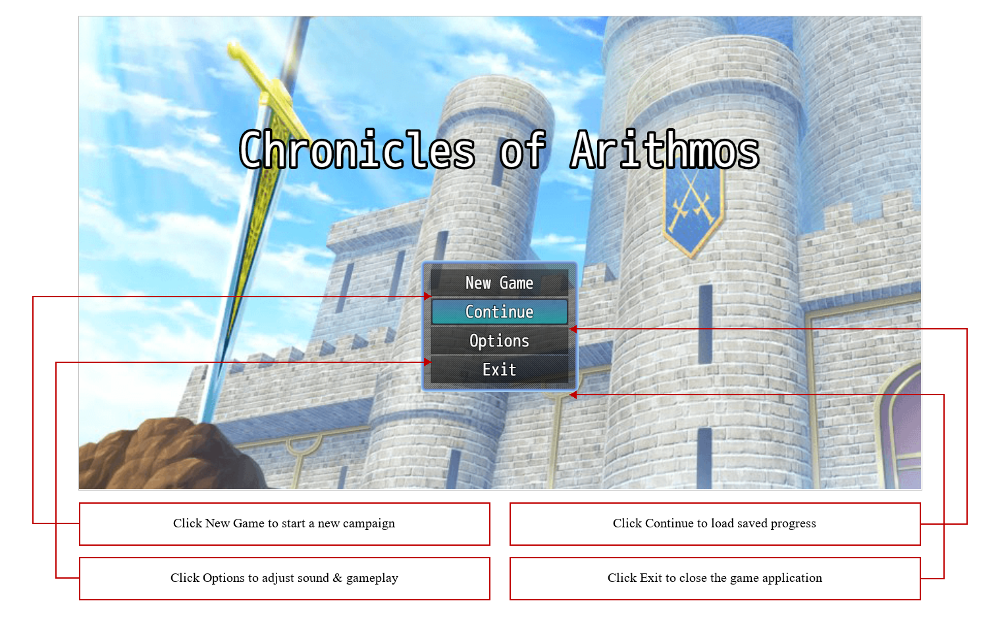

**Narrative Overview and Operational Context:**  
The Title Screen is the main entry portal of the application. It displays the title banner over the royal citadel environment with the celestial holy sword in stone. The interface provides four primary navigation options: New Game, Continue, Options, and Exit.

**Operating Procedures:**  
1. **Starting a New Adventure:** Navigate to **New Game** using keyboard directional keys (`Up`/`Down`) or touch tap, then press `Z`, `Enter`, or `Spacebar` to open the Protagonist Character Name Input screen.
2. **Restoring Previous Progress:** Select **Continue** to open the Continue and Load Game interface, displaying recorded autosaves and manual save files.
3. **Configuring Settings:** Select **Options** to modify audio balance, display HUD elements, and customize touch controls.
4. **Closing the Application:** Select **Exit** on desktop builds to cleanly shut down and terminate the application window.

---

### Figure No.: Figure H-2

### Figure Title: System Options Menu (General & Audio Settings)

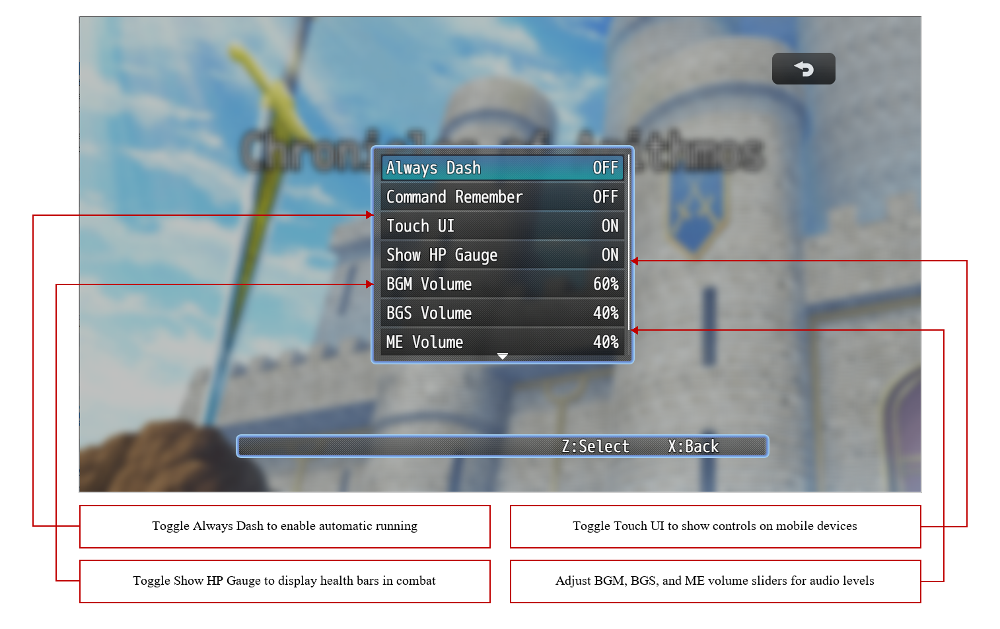

**Narrative Overview and Operational Context:**  
The System Options Menu allows players to configure operational gameplay parameters and audio volume levels. The configuration is automatically persisted to local client storage.

**Operating Procedures:**  
1. **Toggling Continuous Running:** Select **Always Dash** and press `Z` or tap to switch between `ON` and `OFF` for automatic character dashing.
2. **Managing Battle Memory:** Toggle **Command Remember** to retain the last selected combat command position during turn transitions.
3. **Configuring Touch UI:** Toggle **Touch UI** to display on-screen virtual navigation pads and combat menu overlays on mobile devices.
4. **Displaying Health Indicators:** Toggle **Show HP Gauge** to render real-time health bars above active combatants in battle.
5. **Adjusting Audio Volumes:** Select **BGM Volume**, **BGS Volume**, or **ME Volume** and use `Left`/`Right` arrow keys or touch sliders to calibrate background music, atmospheric effects, and musical event sounds from 0% to 100%.

---

### Figure No.: Figure H-3

### Figure Title: System Options Menu (Sound Effect Setting)

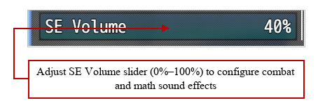

**Narrative Overview and Operational Context:**  
The second section of the System Options Menu governs the sound effect (SE) audio channel, which outputs math submission feedback, UI selection clicks, and battle ability audio.

**Operating Procedures:**  
1. **Calibrating Sound Effects:** Select **SE Volume** and adjust the horizontal slider using `Left`/`Right` directional inputs or screen tapping. The default level is set to 40% to balance audio comfort during math exercise feedback.
2. **Exiting Options:** Press `X`, `Escape`, or the on-screen Back button to commit the audio preferences and return to the primary menu.

---

### Figure No.: Figure H-4

### Figure Title: Continue and Load Game Interface

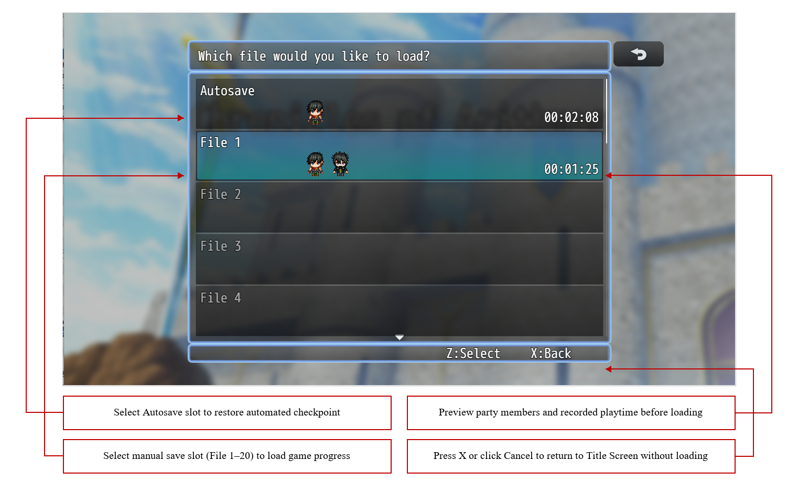

**Narrative Overview and Operational Context:**  
The Continue and Load Game Interface lets players restore saved progress files from local storage. The menu lists a dedicated Autosave slot followed by twenty manual save slots (File 1 through File 20) with active party previews and total playtime timestamps.

**Operating Procedures:**  
1. **Loading Autosaved Checkpoints:** Highlight the **Autosave** slot at the top of the list and press `Z` or double-tap to resume from the latest automatic milestone.
2. **Selecting Manual Save Slots:** Scroll through the save slot listing using `Up`/`Down` arrow keys or swipe gestures. Active slots showcase hero portraits, party levels, current map location, and gameplay timestamps.
3. **Confirming File Load:** Press `Z` or tap the target slot to immediately reconstruct party stats, quest states, and world progress.
4. **Canceling Load Operation:** Press `X`, `Escape`, or tap the on-screen Back button to return to the Title Screen.

---

### Figure No.: Figure H-5

### Figure Title: Protagonist Character Name Input Interface

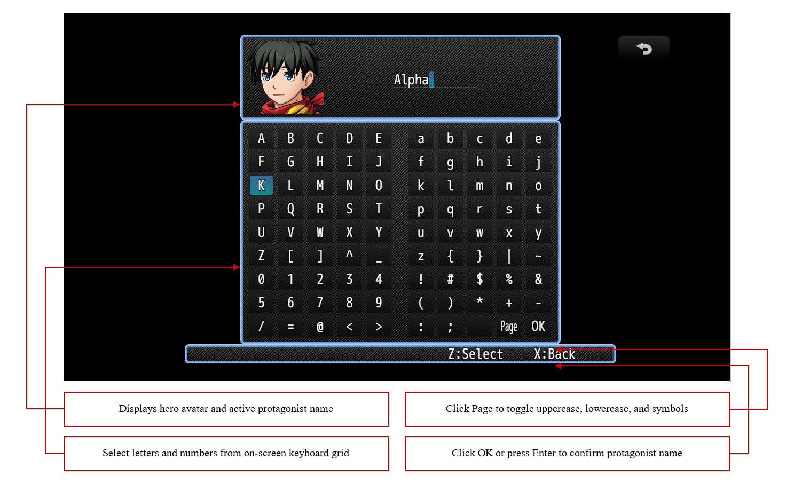

**Narrative Overview and Operational Context:**  
The Protagonist Character Name Input Interface initiates upon selecting New Game. It allows the learner to personalize their hero's name using a visual on-screen keyboard grid or hardware keyboard input.

**Operating Procedures:**  
1. **Character Inspection:** View the protagonist hero avatar portrait and the active text entry field displaying the default name *Alpha*.
2. **Entering Custom Name:** Navigate the alphanumeric matrix using directional keys or touch taps. Select uppercase letters, lowercase letters, numbers, and symbols to spell the desired name.
3. **Switching Character Sets:** Select the **Page** button to toggle between uppercase, lowercase, special characters, and numeric pages.
4. **Confirming Name Submission:** Select the **OK** button or press `Enter` on a physical keyboard to finalize character registration and launch the prologue adventure.

---

### Figure No.: Figure H-6

### Figure Title: Overworld & Interior Exploration Environment

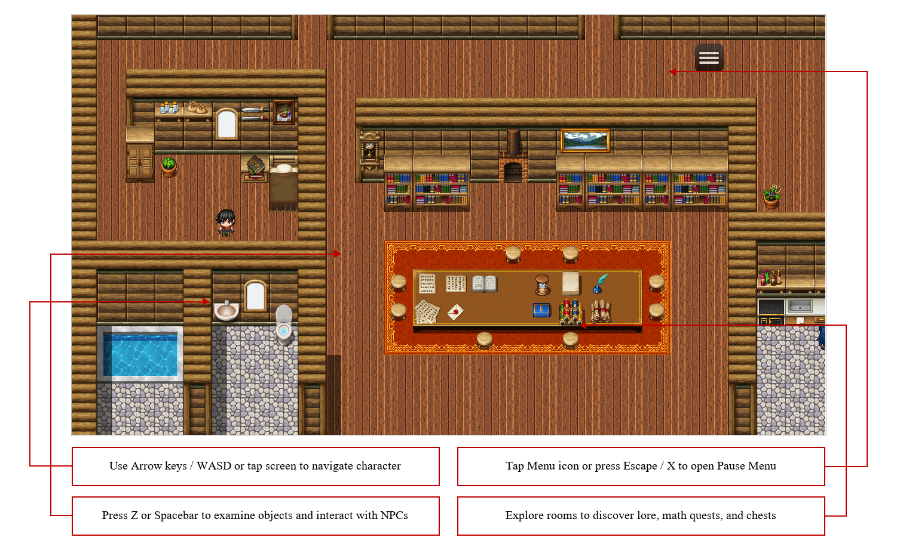

**Narrative Overview and Operational Context:**  
The Exploration Environment provides a 2D top-down perspective of the game world. Players explore environments such as the Adventurer Lodge, interacting with NPCs, inspectable lore objects, and narrative triggers.

**Operating Procedures:**  
1. **Navigating the Environment:** Use `Arrow` keys, `WASD`, or screen touch destination tapping to move the protagonist throughout rooms, hallways, and exterior zones.
2. **Interacting with World Objects:** Stand adjacent to NPCs, bookshelves, desks, fireplace hearths, or chests and press `Z`, `Spacebar`, or tap the target entity to initiate dialogue or examine clues.
3. **Opening the System Menu:** Tap the on-screen touch Menu icon located in the upper-right corner or press `Escape` / `X` on a physical keyboard to access the Main System Pause Menu.

---

### Figure No.: Figure H-7

### Figure Title: Main System Pause Menu

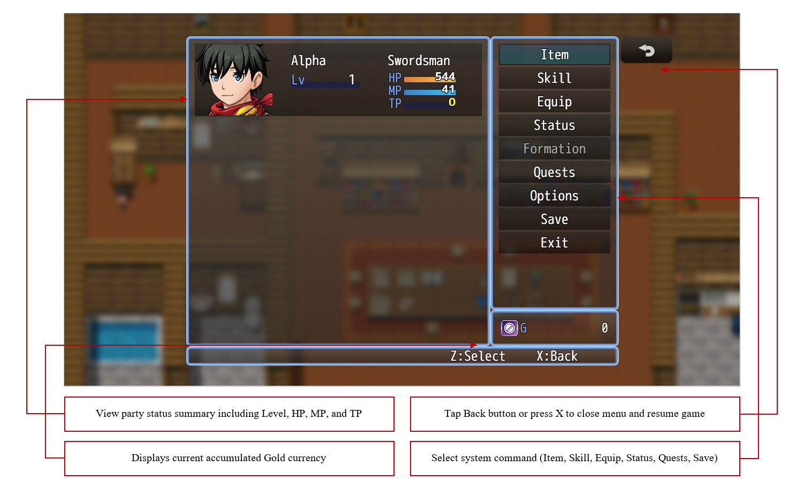

**Narrative Overview and Operational Context:**  
The Main System Pause Menu provides centralized access to character party management, inventory consumption, equipment customization, quest tracking, system options, and game saving.

**Operating Procedures:**  
1. **Inspecting Party Summary:** Review the left-hand party card to inspect active hero avatar portraits, current Class (*Swordsman*), Level (*Lv 1*), and real-time HP, MP, and TP vital status gauges.
2. **Accessing Submenus:** Navigate the right-hand command list to select **Item**, **Skill**, **Equip**, **Status**, **Formation**, **Quests**, **Options**, **Save**, or **Exit**.
3. **Monitoring Currency:** View accumulated Gold currency (*G*) in the lower-right summary box.
4. **Closing Pause Menu:** Tap the top-right Back button or press `X` / `Escape` to close the pause overlay and resume world exploration.

---

### Figure No.: Figure H-8

### Figure Title: Inventory & Item Management Menu

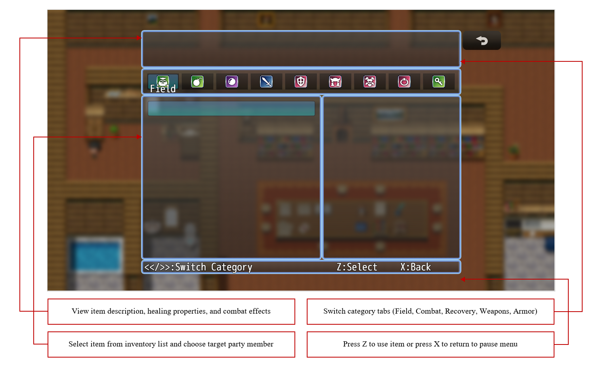

**Narrative Overview and Operational Context:**  
The Inventory and Item Management Menu categorizes, manages, and executes consumables, key quest artifacts, weapons, and protective equipment.

**Operating Procedures:**  
1. **Reading Item Specifications:** Highlight any item to inspect its description, restorative potency, and tactical effects in the upper banner window.
2. **Filtering Categories:** Switch across category tabs (**Field Items**, **Combat Consumables**, **Magical Recovery**, **Weapons**, **Shields**, **Headgear**, **Body Armor**, **Accessories**, **Key Items**) using `Left`/`Right` directional inputs or tab icons.
3. **Using Consumables:** Select an available consumable item with `Z` or touch tap, select the target party member (e.g., Alpha), and confirm application to restore HP/MP or remove status ailments.
4. **Exiting Inventory:** Press `X` or tap Back to return to the Main Pause Menu.

---

### Figure No.: Figure H-9

### Figure Title: Character Skills & Abilities Management Menu

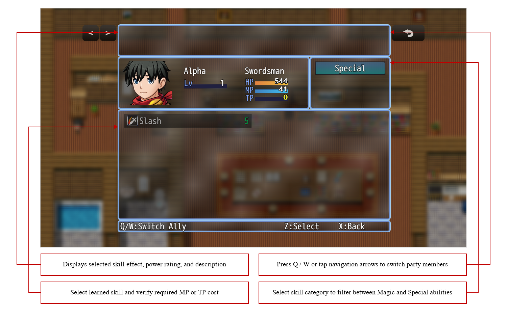

**Narrative Overview and Operational Context:**  
The Character Skills Menu lets players inspect unlocked magic spells, physical combat techniques, and mathematical offensive abilities available to each party member.

**Operating Procedures:**  
1. **Switching Party Members:** Press `Q` / `W` or tap the left/right arrow buttons in the upper-left corner to cycle between active party members (*Alpha*, *Elara*, *Thorne*).
2. **Selecting Skill Categories:** Filter between **Magic**, **Special**, and **Math Combat Skills** using the category panel.
3. **Reviewing Ability Requirements:** Highlight a skill (such as *Slash*) to inspect its mechanical function, damage scaling, and required MP or TP resource cost.
4. **Returning to Menu:** Press `X` or tap Back to exit the skills management interface.

---

### Figure No.: Figure H-10

### Figure Title: Character Equipment & Gear Configuration Menu

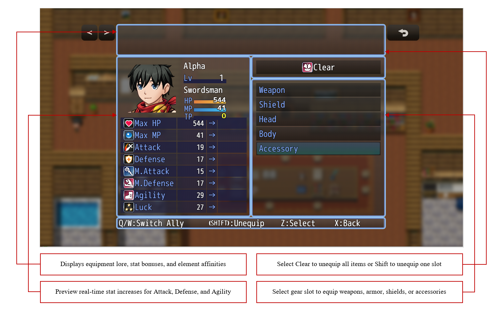

**Narrative Overview and Operational Context:**  
The Character Equipment Menu allows players to optimize offensive weapons, defensive armor, shields, and stat-enhancing accessories across all active party members.

**Operating Procedures:**  
1. **Reviewing Gear Descriptions:** Highlight an equipped item or inventory piece to display lore, stat augmentations, and elemental affinities in the top header.
2. **Selecting Equipment Slots:** Navigate through five dedicated gear slots: **Weapon**, **Shield**, **Head**, **Body**, and **Accessory**. Press `Z` or tap to view compatible replacements.
3. **Evaluating Stat Changes:** Observe real-time parameter comparison previews on the left panel for Max HP, Max MP, Attack, Defense, Magic Attack, Magic Defense, Agility, and Luck.
4. **Managing Inventory Slots:** Select **Clear** to unequip all active gear simultaneously, or press `Shift` to strip only the selected slot.

---

### Figure No.: Figure H-11

### Figure Title: Character Status & Detailed Attributes Menu

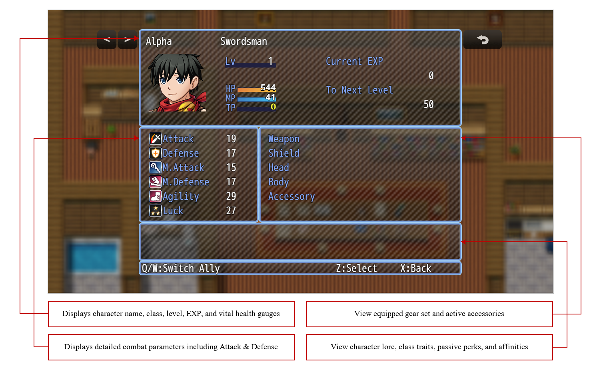

**Narrative Overview and Operational Context:**  
The Character Status Menu provides complete statistical visibility into character progression, experience thresholds, combat attributes, equipped gear, and class lore.

**Operating Procedures:**  
1. **Inspecting Character Progression:** Review character name, active class, current level, total accumulated EXP, and EXP required to reach the next level in the top header card.
2. **Analyzing Combat Parameters:** Examine base and gear-modified combat attributes on the middle-left card (Attack, Defense, M.Attack, M.Defense, Agility, Luck).
3. **Viewing Gear Configuration:** Verify currently equipped weapons, shields, and accessories in the middle-right column.
4. **Reading Class Lore & Traits:** Review biographical lore, passive combat traits, and elemental resistance percentages in the bottom information window.

---

### Figure No.: Figure H-12

### Figure Title: Party Formation & Roster Arrangement Menu

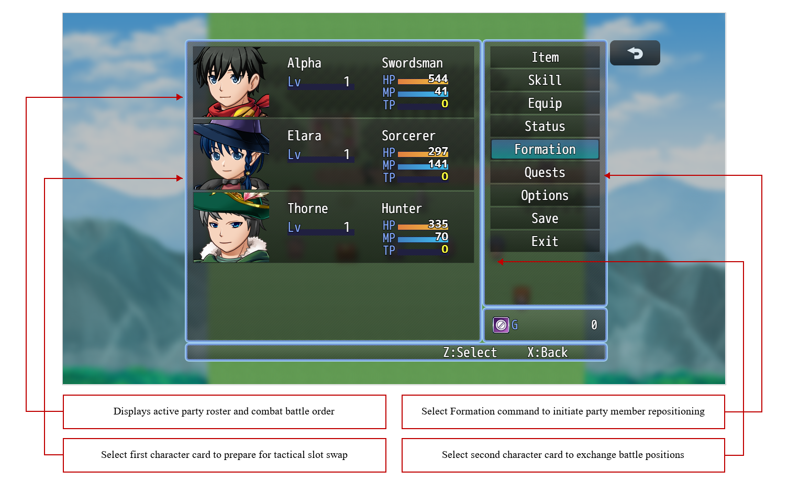

**Narrative Overview and Operational Context:**  
The Party Formation Menu allows players to strategically arrange party member positioning across combat rows to optimize battle tactics and survivability.

**Operating Procedures:**  
1. **Selecting Formation Mode:** Highlight and select the **Formation** command on the right-hand command window.
2. **Selecting First Combatant:** Select the character card of the party member to be moved (e.g., *Alpha* - Swordsman).
3. **Selecting Second Combatant:** Select the target character card to swap positions with (e.g., *Thorne* - Hunter).
4. **Confirming Arrangement:** The two character cards immediately exchange battle order and formation slots, deploying high-durability characters to frontline positions and spellcasters to rear positions.

---

### Figure No.: Figure H-13

### Figure Title: Quests & Mission Log Interface

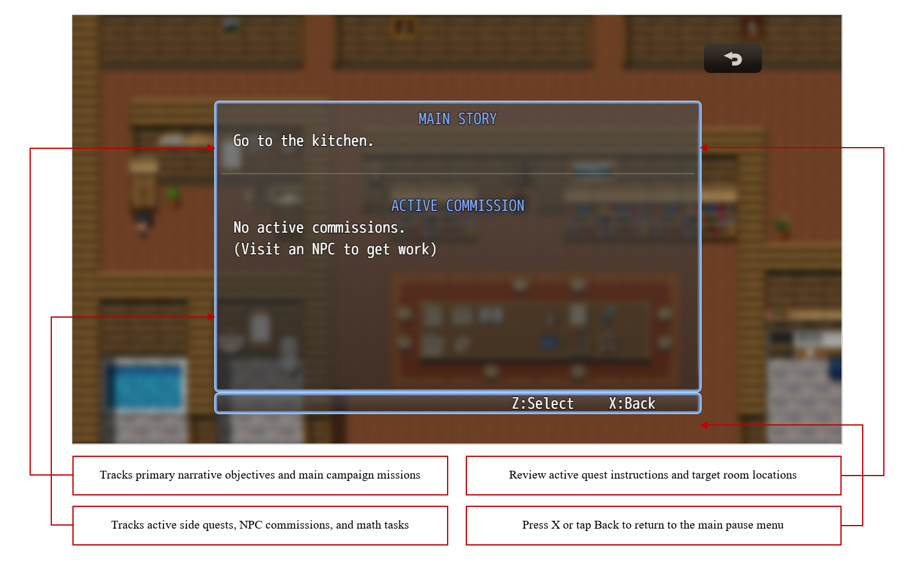

**Narrative Overview and Operational Context:**  
The Quests and Mission Log Interface tracks primary narrative story objectives and procedural side quests accepted from guild NPCs and mathematical commission boards.

**Operating Procedures:**  
1. **Tracking Main Story Tasks:** Review the upper **MAIN STORY** section to identify active campaign objectives, story hints, and designated room destinations.
2. **Monitoring Active Commissions:** Review the lower **ACTIVE COMMISSION** panel to track optional side quests, NPC requests, and mathematical challenges accepted from Receptionist Mila.
3. **Checking Completion Criteria:** Verify item turn-in counts, enemy defeat targets, and arithmetic score thresholds required to claim rewards.
4. **Exiting Quest Log:** Press `X`, `Escape`, or tap Back to return to exploration or the main pause screen.

---

### Figure No.: Figure H-14

### Figure Title: Game Save & Progress Recording Interface

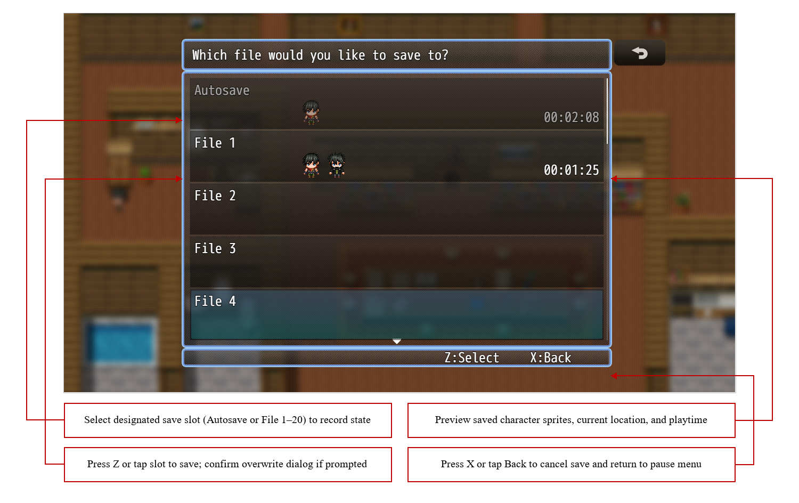

**Narrative Overview and Operational Context:**  
The Game Save Interface allows players to write active game state, character statistics, quest progress, and inventory records into persistent local device storage.

**Operating Procedures:**  
1. **Selecting Save Slot:** Navigate through the save roster using directional inputs or touch scrolling. The list contains twenty manual save files and an Autosave slot.
2. **Previewing Save Metadata:** Review character sprites, party level indicators, current map locale, and timestamp data before overwriting.
3. **Executing Save Operation:** Press `Z` or tap the desired save slot. Confirm the overwrite dialog when prompted to write progress data.
4. **Canceling Save:** Press `X`, `Escape`, or tap Back to abort saving without altering existing files.

---

### Figure No.: Figure H-15

### Figure Title: Return to Title / Game Exit Confirmation Dialog

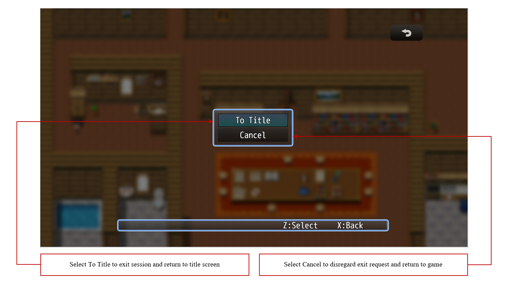

**Narrative Overview and Operational Context:**  
The Game Exit Confirmation Dialog prevents accidental loss of unsaved game data when attempting to quit the current session.

**Operating Procedures:**  
1. **Returning to Title Screen:** Select **To Title** and press `Z`, `Enter`, or touch tap to terminate the active exploration/combat session and return to the main Title Screen.
2. **Aborting Exit Request:** Select **Cancel** or press `X` / `Escape` to dismiss the exit modal and safely resume the game session.

---

### Figure No.: Figure H-16

### Figure Title: Tactical Battle Command Menu - Page 1 (Primary Actions)

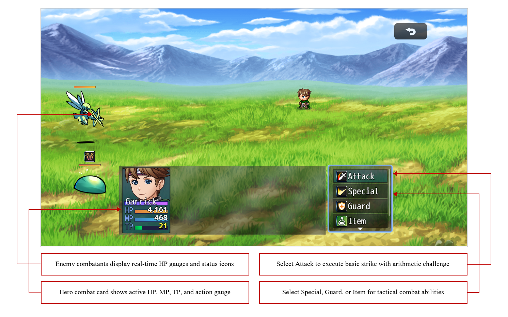

**Narrative Overview and Operational Context:**  
The Tactical Battle Command Menu (Page 1) provides core offensive and defensive turn actions during combat encounters in the Plains Biome and dungeon territories.

**Operating Procedures:**  
1. **Inspecting Enemy Combatants:** Observe enemy monster battlers on the left field along with their real-time health bars and active status condition icons.
2. **Monitoring Hero Vital Gauges:** Inspect the lower-left hero combat card (*Garrick*) displaying current HP, MP, TP, and turn action readiness.
3. **Selecting Attack:** Select **Attack** to initiate a basic physical weapon strike, triggering the Math Battle arithmetic engine.
4. **Selecting Special, Guard, or Item:** Select **Special** for advanced skills, **Guard** to reduce incoming enemy damage by 50% for the turn, or **Item** to access restorative consumables.

---

### Figure No.: Figure H-17

### Figure Title: Tactical Battle Command Menu - Page 2 (System & Tactical Actions)

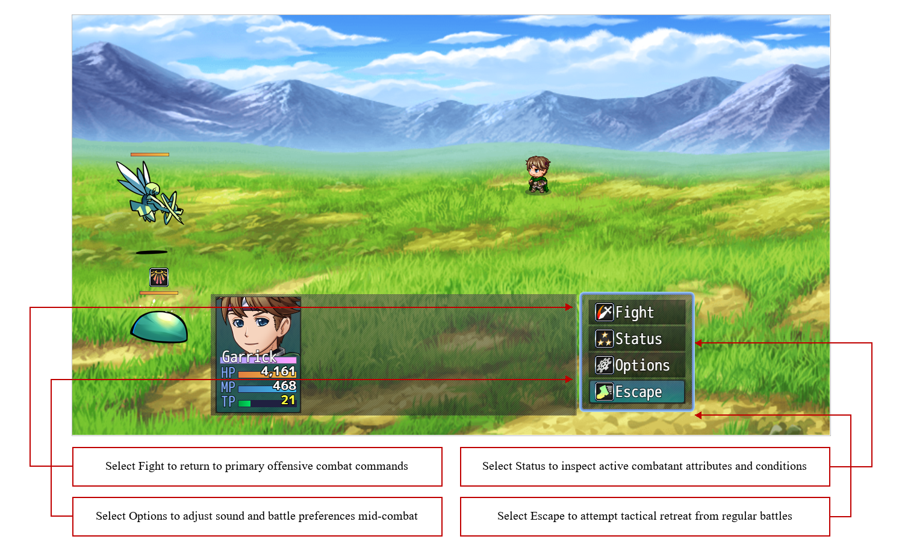

**Narrative Overview and Operational Context:**  
The second page of the Tactical Battle Command Menu provides auxiliary operational commands during active combat engagements.

**Operating Procedures:**  
1. **Returning to Offensive Actions:** Select **Fight** to return to Page 1 of the battle command menu (**Attack**, **Special**, **Guard**, **Item**).
2. **Inspecting Combatant Status:** Select **Status** to open the real-time condition and combat attribute breakdown of active party members.
3. **Adjusting Mid-Combat Settings:** Select **Options** to modify sound effect and background music volumes during combat.
4. **Retreating from Battle:** Select **Escape** to attempt a tactical retreat from non-boss encounters.

---

### Figure No.: Figure H-18

### Figure Title: Battle Skills & Special Abilities Selection Submenu

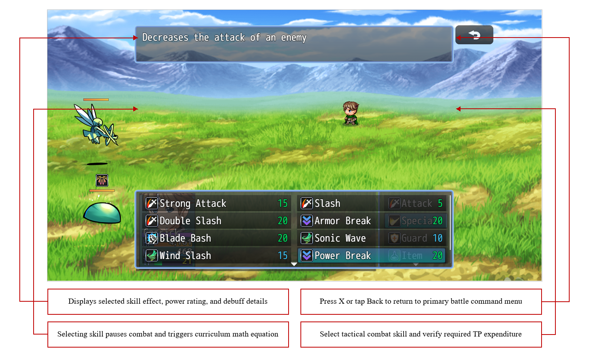

**Narrative Overview and Operational Context:**  
The Battle Skills Submenu displays unlocked tactical abilities that can be unleashed by expending Tactical Points (TP) or Magic Points (MP).

**Operating Procedures:**  
1. **Reviewing Skill Descriptions:** Highlight any ability (*Power Break*, *Strong Attack*, *Double Slash*, *Sonic Wave*) to read its damage scaling, tactical debuffs, and target scope in the top banner.
2. **Checking Resource Expenditure:** Verify the required TP cost displayed on the right edge of each skill entry.
3. **Executing Skill:** Select the desired skill with `Z` or touch tap. This pauses combat action and initiates a curriculum-aligned arithmetic problem.
4. **Canceling Selection:** Press `X`, `Escape`, or tap Back to return to the primary battle command menu.

---

### Figure No.: Figure H-19

### Figure Title: Battle Consumables & Item Selection Submenu

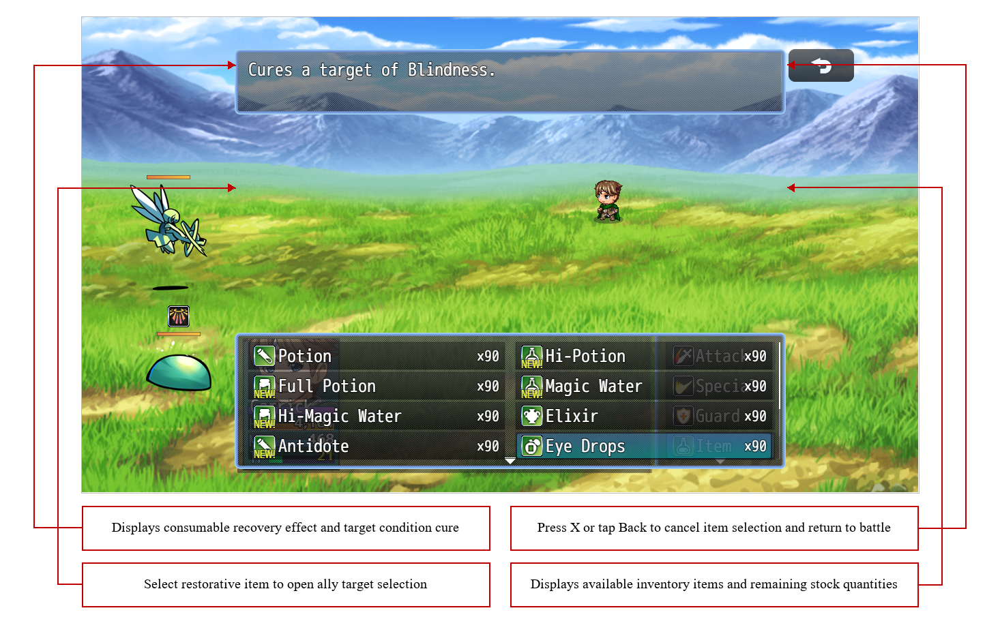

**Narrative Overview and Operational Context:**  
The Battle Consumables Submenu allows players to administer restorative potions, magical elixirs, and status remedy items during turn-based combat.

**Operating Procedures:**  
1. **Reviewing Item Potency:** Highlight an inventory item (*Potion*, *Hi-Magic Water*, *Antidote*, *Eye Drops*) to read its restorative properties in the top header.
2. **Checking Stock Quantity:** Verify remaining inventory counts (e.g., `x90`) displayed adjacent to each item name.
3. **Applying to Ally Target:** Select the consumable with `Z` or touch tap, select the target party member, and confirm to execute recovery.
4. **Aborting Selection:** Press `X` or tap Back to cancel item selection and return to the combat action menu.

---

### Figure No.: Figure H-20

### Figure Title: Combatant Tactical Status & Condition Submenu

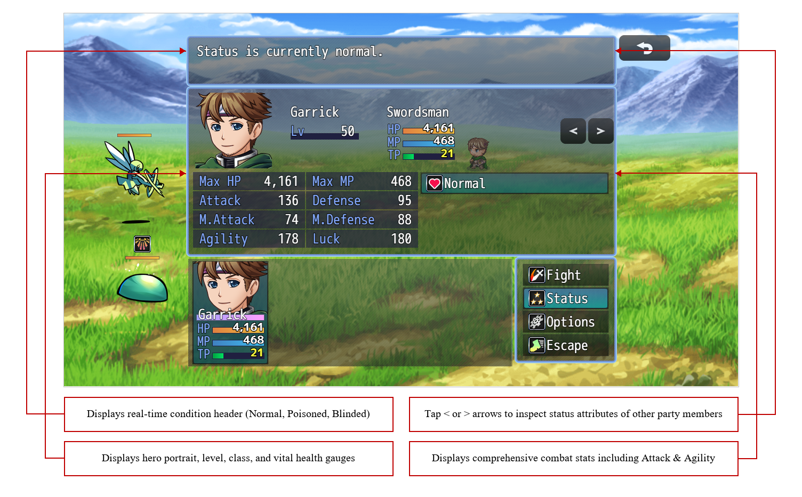

**Narrative Overview and Operational Context:**  
The Combatant Tactical Status Submenu provides real-time visibility into active combat parameters, buff durations, and debilitating status ailments during combat.

**Operating Procedures:**  
1. **Inspecting Condition Header:** Read the top condition banner displaying overall physical condition (*Status is currently normal*, *Poisoned*, *Blinded*, *Stunned*).
2. **Reviewing Vital Indicators:** Inspect the central profile card displaying character level (*Lv 50*), current HP, MP, and TP values.
3. **Analyzing Active Combat Parameters:** Review Attack, Defense, M.Attack, M.Defense, Agility, and Luck stats on the right-hand panel.
4. **Cycling Party Members:** Tap the `<` and `>` arrow icons in the upper-right corner or press `Q`/`W` to inspect other party combatants.

---

### Figure No.: Figure H-21

### Figure Title: Math Battle System & Mobile Virtual Numeric Keypad Interface

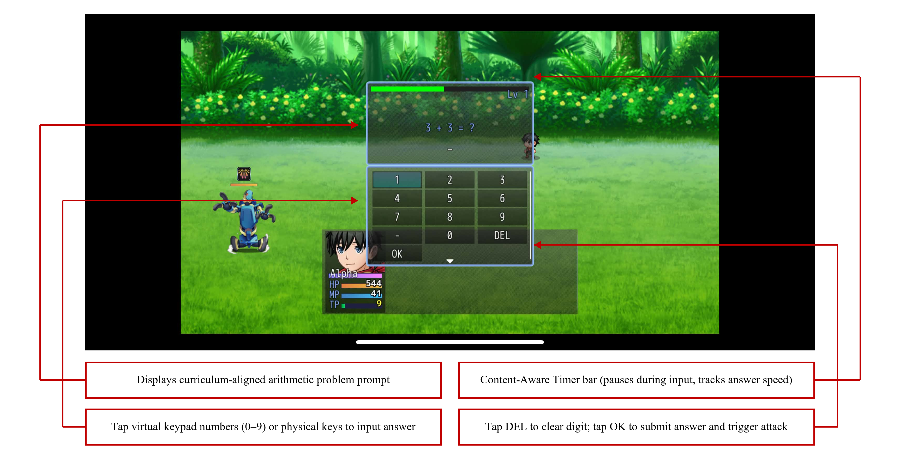

**Narrative Overview and Operational Context:**  
The Math Battle System and Mobile Virtual Numeric Keypad Interface executes whenever the player initiates an offensive strike or tactical ability. It challenges the young learner with curriculum-aligned arithmetic problems while managing an adaptive Content-Aware Timer.

**Operating Procedures:**  
1. **Reading the Arithmetic Prompt:** Observe the generated arithmetic problem (e.g., `3 + 3 = ?`) displayed in the central challenge window.
2. **Monitoring the Content-Aware Timer:** Observe the upper green timer bar. The timer tracks response latency to award critical hit multipliers ($2.0\times$) for rapid and accurate mental math computations.
3. **Entering Numerical Answers:** Input numeric answers using the touch virtual keypad grid (`0` through `9`, minus `-`), or by typing directly on a physical keyboard or numpad.
4. **Correcting Input:** Tap **DEL** or press `Backspace` on a keyboard to erase incorrect digits.
5. **Submitting Answer:** Tap the **OK** button or press `Enter` to submit the solution to the Math Engine. Correct solutions unleash devastating critical strikes; incorrect answers trigger adaptive scaffolding and reduced attack potency.

---

## Guidelines for User Manual Operations (DCT CCS Compliance)

1. **System Interface Coverage:** The User’s Manual comprehensively details all 21 core graphical interfaces of *Chronicles of Arithmos*, covering desktop exploration, pause menus, party organization, inventory management, tactical turn-based combat, and the dynamic math keypad engine.
2. **Dual Platform Navigation:** Every operational procedure includes verified control mappings for physical keyboards (`Z`, `X`, `WASD`, `Enter`, `Escape`, `Shift`, `Q`, `W`), desktop mouse navigation, and mobile touchscreen gestures.
3. **Visual Callout Integration:** All accompanying figures feature standardized crimson red indicator boxes and orthogonal arrow connectors directly pointing to relevant UI controls, input fields, and HUD gauges on clean white background frames.
4. **Academic Compliance:** Section titles, figure labeling, third-person descriptive phrasing, and sequential operating steps strictly conform to Dominican College of Tarlac (DCT) College of Computer Studies (CCS) Capstone standards.
